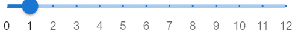

<!-- [](https://classroom.github.com/a/IYxRLrPq) -->

# Tugas Besar Grafika Komputer 2

## Link Demo / Panduan
https://drive.google.com/drive/folders/1nUGhdG_9SZGg8aEkW3wCgTbBQ5yk0dLv?usp=sharing

## Members Group / Task Assignment
 - 13521135 Nicholas Liem (All)
 - 13521145 Kenneth Dave Bahana (All)
 - 13521159 Sulthan Dzaky Alfaro (All)
 - 13521169 Muhammad Habibi Husni (All)

## How To Start The Application
 -  Clone this repository with command
 ```
 git clone https://github.com/GAIB20/tugas-besar-grafkom-2-ndhs.git
 ``` 
 - After clone this repository, go to the directory the project
 - After in the directory of project, start the application with comman
 ```
 npm run dev
 ```
 - Go to website and go to ```localhost:3000``` to open the application, wait until the program finish the build. 
 

## How To Use The Application

### Animation


In the animation, you can control the animation with many tools. 

 - You can slide this menu to go to frame what you want (the number is the number of frame)

    

 - You can play (1) and stop (2) the animation, you can go to first frame (3), go to 1 frame before current frame (4), go to 1 frame after current frame (5), and go to last frame (6). You can reverse if the reverse active (7) and you can repeat the animation (8)

    

 - You can change the speed of animation with change the number of fps and press enter

    

### Camera

You can change the radius of camera (how close the camera is to the object), angle of camera and change view type of camera (Perspective, Orthographic, and Oblique)


### Model

You can change the model with add the object and remove the object. 


You can save the model and load the model. Save model is download file json of current model in website. Important to note, load model must with the json file and same the struct like you save the model. You can also reset the model to first state of web is loaded.


